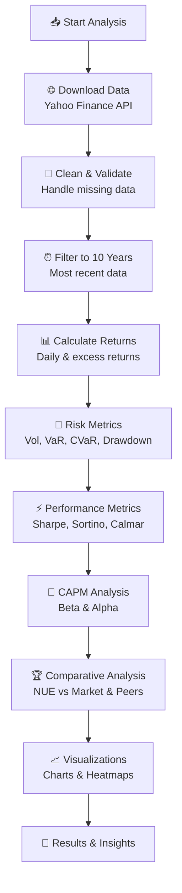

# 📊 Nucor Corporation (NUE) Statistical Analysis

[](https://www.python.org/downloads/)
[](LICENSE)
[](https://jupyter.org/)
[](https://finance.yahoo.com/)
[](README.md)

> 🚀 **A comprehensive financial analysis toolkit** for Nucor Corporation (NYSE: NUE) using Python to perform statistical modeling, risk assessment, and performance evaluation against the market and industry peers!

**📈 Pro Tip:** Check out our [attached presentation](50%20PORTFOLIO%20TEAM%207.pdf) for a complete overview! 🎯

---

## 📑 Table of Contents

- [🎯 Key Findings](#-key-findings)
- [✨ Quick Start](#-quick-start)
- [🎨 What Makes This Cool?](#-what-makes-this-cool)
- [🔄 Analysis Workflow](#-analysis-workflow)
- [💻 Installation](#-installation)
- [🎮 Usage](#-usage)
- [📊 What You'll Get](#-what-youll-get)
- [🔬 Technical Deep Dive](#-technical-deep-dive)
- [📚 Understanding the Metrics](#-understanding-the-metrics)
- [🤝 Contributing](#-contributing)
- [⚠️ Disclaimer](#️-disclaimer)

---

## 🎯 Key Findings

Here's what makes NUE's performance stand out! 🌟

### 📈 Performance Highlights (10-Year Analysis)

Our analysis reveals fascinating insights about Nucor's performance:

| Metric | What It Means | Why It Matters |
|--------|---------------|----------------|
| 📊 **Annualized Return** | How much $ grows per year | Higher = better wealth creation 💰 |
| 🎢 **Volatility** | How bumpy the ride is | Lower = smoother investment experience |
| ⚡ **Sharpe Ratio** | Return per unit of risk | Higher = smarter risk-taking |
| 🛡️ **Max Drawdown** | Worst peak-to-trough decline | Shows worst-case scenario 😰 |
| 🎯 **Win Rate** | % of positive return days | Consistency indicator 📅 |

### 🏆 Competitive Standing

We compare NUE against:
- 📊 **S&P 500 (SPY)** - The market benchmark
- 🏭 **Industry Peers**: STLD, CLF, SLX, CMC, MT
- 📈 **Result?** See how NUE stacks up in the steel industry!

> 💡 **Fun Fact:** The analysis automatically downloads fresh data from Yahoo Finance, so you're always working with the latest information!

---

## ✨ Quick Start

Get up and running in **3 easy steps**! 🚀

### 1️⃣ Clone the Repository
```bash
git clone <repository-url>
cd Nucor_Statist
```

### 2️⃣ Install Dependencies
```bash
pip install -r requirements.txt
```
*Or just run the first cell in the notebook - it handles everything automatically!* 🎯

### 3️⃣ Open & Run the Notebook
```bash
jupyter notebook NUCOR_Statistical.ipynb
```
Hit "Run All" and watch the magic happen! ✨

---

## 🎨 What Makes This Cool?

This isn't just another boring financial analysis - here's what makes it special! 🌟

### 💎 Financial Metrics Arsenal

#### 📈 Return Analysis
- Daily, annualized, and excess returns
- Risk-free rate adjusted metrics
- 10-year historical performance

#### 🎯 Risk Metrics
- 📊 **Annualized Volatility** - How wild the ride gets!
- 🎢 **Maximum Drawdown** - Worst nightmare scenario
- ⚠️ **Value at Risk (VaR)** - Expected loss at 95% confidence
- 🔴 **Conditional VaR (CVaR)** - Average loss beyond VaR threshold

#### ⚡ Risk-Adjusted Performance
- 🏆 **Sharpe Ratio** - Return per unit of total risk
- 🛡️ **Sortino Ratio** - Like Sharpe, but only cares about downside
- 📉 **Calmar Ratio** - Return per unit of max drawdown

#### 🔍 Market Analysis
- 📐 **Beta** - How much NUE moves with the market
- 🌟 **Alpha** - Excess return above expected (the secret sauce!)
- 🔗 **Correlation** - Relationships with market and peers

#### 🎲 Additional Goodies
- ✅ **Win Rate** - Percentage of profitable days
- 📉 **Drawdown Analysis** - When things got rough
- 📊 **Distribution Analysis** - Return patterns and behaviors

### 🏭 Competitive Benchmarking

Compare Nucor against the best in the business:
- **Market Benchmark**: S&P 500 (SPY)
- **Steel Industry Peers**:
  - Steel Dynamics (STLD)
  - Cleveland-Cliffs (CLF)
  - Steel ETF (SLX)
  - Commercial Metals Company (CMC)
  - ArcelorMittal (MT)

---

## 🔄 Analysis Workflow

Here's how the magic happens! ✨



---

## 💻 Installation

### 🔧 Prerequisites
- Python 3.8 or higher 🐍
- pip package manager 📦
- Jupyter Notebook (optional but recommended) 📓

### 📦 Required Packages

All the cool tools we use:

| Package | Purpose | Why We Love It |
|---------|---------|----------------|
| `yfinance` | Financial data | Free market data! 📊 |
| `pandas` | Data manipulation | Makes data wrangling easy 🐼 |
| `numpy` | Numerical computing | Math powerhouse 🔢 |
| `matplotlib` | Visualization | Beautiful charts 📈 |
| `seaborn` | Statistical viz | Makes charts pretty 🎨 |
| `scipy` | Statistics | Science! 🔬 |
| `scikit-learn` | Machine learning | For CAPM regression 🤖 |

### 🚀 Installation Methods

**Option 1: Using requirements.txt (Recommended)**
```bash
pip install -r requirements.txt
```

**Option 2: Let the Notebook Handle It**
Just run the first cell in `NUCOR_Statistical.ipynb` - it automatically installs everything you need! 🎯

---

## 🎮 Usage

### 🏃 Running the Analysis

1. **Fire up Jupyter:**
```bash
jupyter notebook NUCOR_Statistical.ipynb
```

2. **Run all cells** (Cell → Run All) and watch as it:
   - 🌐 Downloads the latest market data
   - 🧮 Calculates all financial metrics
   - 📊 Generates beautiful visualizations
   - 🔍 Performs statistical analysis
   - 🏆 Compares performance

### ⚙️ Configuration

Want to analyze different stocks or time periods? Easy! Just modify these parameters in the notebook:

```python
TICKER = "NUE"                    # 🎯 Primary stock ticker
MARKET = "SPY"                    # 📊 Market index benchmark
PEERS = ["STLD", "CLF", "SLX", "CMC", "MT"]  # 🏭 Peer companies
START_DATE = "2014-01-01"         # 📅 Analysis start date
TRADING_DAYS = 252                # 📆 Annual trading days
RISK_FREE = 0.04081               # 💰 Risk-free rate (1-year Treasury)
```

> 💡 **Pro Tip:** Update the `RISK_FREE` rate to match current 1-year Treasury yields for the most accurate CAPM analysis!

---

## 📊 What You'll Get

Running this notebook gives you an **awesome** analysis dashboard! 🎨

### 📈 Visualizations Include:

1. **📉 Price Performance Charts**
   - Cumulative growth comparison
   - NUE vs SPY vs Industry Peers
   - Annotated with key milestones

2. **🎲 Return Distributions**
   - Histogram of daily returns
   - Normal distribution overlays
   - Tail risk visualization

3. **🎯 Risk-Return Scatter Plots**
   - Each asset plotted by risk vs return
   - Efficient frontier visualization
   - Bubble sizes = importance

4. **🔥 Correlation Heatmaps**
   - Beautiful color-coded matrix
   - See how assets move together
   - Identify diversification opportunities

5. **📉 Drawdown Visualizations**
   - Underwater equity curve
   - Maximum drawdown periods highlighted
   - Recovery time analysis

6. **📊 Comprehensive Summary Tables**
   - All metrics in one place
   - Color-coded for easy reading
   - Sortable and exportable

---

## 🔬 Technical Deep Dive

For those who want to understand the *how* behind the magic! 🧙‍♂️

### 🎯 Analysis Components

#### 1️⃣ Data Collection
- 🌐 Automatically downloads historical price data using Yahoo Finance API
- 🔍 Handles missing data and validates data integrity
- ⏰ Filters data to the most recent 10-year period for analysis
- ✅ Error handling for unavailable tickers

#### 2️⃣ Return Calculations
- 📊 Computes daily simple returns: \( r_t = \frac{P_t - P_{t-1}}{P_{t-1}} \)
- 💰 Calculates excess returns for CAPM analysis
- 📈 Derives risk-free rate adjusted metrics
- 🎯 Annualizes returns properly

#### 3️⃣ Risk Assessment
- 📏 Quantifies various risk measures
- 🎢 Identifies maximum drawdown periods
- ⚠️ Calculates tail risk metrics (VaR and CVaR at 95% confidence)
- 📊 Computes annualized volatility

#### 4️⃣ Performance Evaluation
- ⚡ Compares risk-adjusted returns across assets
- ✅ Evaluates consistency of positive returns (win rate)
- 🛡️ Assesses downside risk specifically (Sortino)
- 🏆 Ranks performance metrics

#### 5️⃣ Market Relationship Analysis
- 📐 CAPM beta calculation using proper excess return methodology
- 🌟 Alpha generation analysis
- 🔗 Correlation matrices with market and peers
- 📊 Regression diagnostics

#### 6️⃣ Visualizations
- 📈 Price performance charts with annotations
- 📊 Return distributions with overlays
- 🎯 Risk-return scatter plots
- 🔥 Correlation heatmaps
- 📉 Drawdown visualizations with recovery periods

### 📐 CAPM (Capital Asset Pricing Model)

The **proper** way to calculate expected returns! 📚

```
Expected Return = Risk-Free Rate + Beta × (Market Return - Risk-Free Rate)
```

**Where:**
- 📐 **Beta**: Measures systematic risk relative to the market
  - Beta > 1: More volatile than market 🎢
  - Beta = 1: Moves with market 📊
  - Beta < 1: Less volatile than market 🛡️
- 🌟 **Alpha**: Excess return not explained by market movements (the manager's skill!)
- 💰 **Excess Returns**: Returns adjusted for the risk-free rate
- 📊 **Market Return**: Return of the S&P 500 (SPY)

### 📊 Risk-Adjusted Metrics Explained

#### ⚡ Sharpe Ratio
Measures return per unit of **total** risk.

```
Sharpe Ratio = (Annualized Return - Risk-Free Rate) / Annualized Volatility
```

- Higher is better! 📈
- Typically, 1+ is good, 2+ is great, 3+ is excellent
- Accounts for all volatility (up and down)

#### 🛡️ Sortino Ratio
Like Sharpe, but only cares about **downside** risk.

```
Sortino Ratio = (Annualized Return - Risk-Free Rate) / Downside Deviation
```

- Higher is better! 📈
- Better for investors who don't mind upside volatility
- Only penalizes negative returns

#### 📉 Calmar Ratio
Return per unit of **maximum drawdown**.

```
Calmar Ratio = Annualized Return / |Maximum Drawdown|
```

- Higher is better! 📈
- Shows return per unit of worst-case risk
- Great for understanding disaster scenarios

---

## 📚 Understanding the Metrics

**New to finance?** No worries! Here's what everything means in plain English! 🎓

### 📖 Quick Glossary

| Term | What It Means | Real World Example |
|------|---------------|-------------------|
| **Annualized Return** | How much your money grows per year | 10% means $100 → $110 in a year 💵 |
| **Volatility** | How much prices bounce around | High = roller coaster 🎢, Low = smooth ride 🚗 |
| **Beta** | How much stock moves with market | 1.5 means if market moves 10%, stock moves 15% |
| **Alpha** | Outperformance vs expected | Positive = beating expectations! 🌟 |
| **Sharpe Ratio** | Bang for your buck on risk | Higher = better return for risk taken |
| **VaR (95%)** | Expected loss 5% of the time | -2% means 1 in 20 days loses >2% |
| **Max Drawdown** | Worst peak-to-valley drop | -30% means your $100 became $70 at worst 😰 |
| **Win Rate** | How often you make money | 55% = profit 55% of days 📅 |

### 💡 Tips for Interpretation

- 📈 **High returns** are great, but check the volatility too!
- 🎯 **Sharpe > 1** is solid, **> 2** is great
- 🛡️ **Lower max drawdown** = better sleep at night
- 📊 **Beta > 1** = more volatile than market
- 🌟 **Positive alpha** = outperforming expectations

---

## 🗂️ Project Structure

```
Nucor_Statist/
│
├── 📓 NUCOR_Statistical.ipynb    # Main analysis notebook (the star of the show!)
├── 📦 requirements.txt           # Python dependencies
├── 📄 50 PORTFOLIO TEAM 7.pdf    # Presentation deck
└── 📖 README.md                  # You are here! 👋
```

---

## 🌐 Data Sources

All price data comes from **Yahoo Finance** via the `yfinance` Python library! 📊

**Why Yahoo Finance?**
- ✅ Free and reliable
- 📊 Historical adjusted closing prices
- 🔄 Automatic adjustment for splits and dividends
- 🌍 Comprehensive coverage of US equities and ETFs
- 🚀 Easy Python integration

> 💡 **Note:** Data quality is only as good as the source. Yahoo Finance is great for analysis and education, but always verify with official sources for critical financial decisions!

---

## 🤝 Contributing

Found a bug? Have an idea? Want to add more features? **We'd love your help!** 🎉

### Ways to Contribute:
- 🐛 Report bugs or issues
- 💡 Suggest new features or metrics
- 📊 Add more visualization types
- 📚 Improve documentation
- 🧪 Add test cases
- 🎨 Enhance the UI/UX

**How to contribute:**
1. 🍴 Fork the repository
2. 🌿 Create a feature branch (`git checkout -b feature/AmazingFeature`)
3. 💾 Commit your changes (`git commit -m 'Add some AmazingFeature'`)
4. 📤 Push to the branch (`git push origin feature/AmazingFeature`)
5. 🎯 Open a Pull Request

---

## ⚠️ Disclaimer

**Important Legal Stuff** 📋

This project is for **educational and analytical purposes only**. The financial data and analysis provided should **NOT** be considered as investment advice.

- 📚 This is a learning tool, not a trading system
- 💰 Past performance doesn't guarantee future results
- 🤔 Always conduct your own research
- 👨‍💼 Consult with a qualified financial advisor before making investment decisions
- 🚫 Not responsible for any trading losses

**Remember:** Investing involves risk, including the potential loss of principal. Trade responsibly! 🎯

---

## 📞 Contact & Support

Got questions? Need help? Found something cool? 

- 🐛 **Bug Reports**: Open an issue in this repository
- 💡 **Feature Requests**: Open an issue with the "enhancement" tag
- 🤝 **General Questions**: Open a discussion
- 📧 **Email**: Check repository for contact info

---

## 🎓 Learning Resources

Want to learn more about financial analysis? Check these out! 📚

- 📖 [Investopedia](https://www.investopedia.com/) - Finance concepts explained
- 🎓 [Khan Academy Finance](https://www.khanacademy.org/economics-finance-domain) - Free courses
- 📊 [Python for Finance](https://www.oreilly.com/library/view/python-for-finance/9781492024323/) - Book recommendation
- 🎥 [YouTube Finance Channels](https://www.youtube.com/) - Visual learning

---

## 🏆 Acknowledgments

Built with ❤️ using:
- 🐍 Python
- 📓 Jupyter
- 📊 The amazing open-source data science community

---

<div align="center">

**⭐ If you found this helpful, consider giving it a star! ⭐**

📊 **Making Financial Analysis Accessible and Fun!** 📈

*Last Updated: January 2025*

</div>
